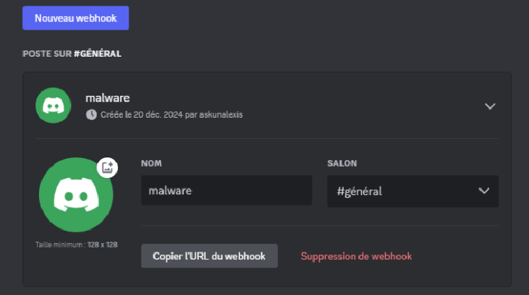
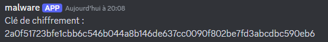
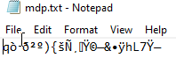
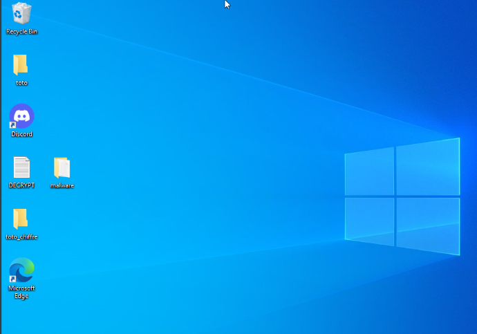
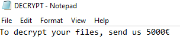

# TP création malware

### 1. Créer un serveur discord avec un webhook.

Pour créer le bot : paramètre serveur, intégration, webhook, initialiser le nom. On peut copier l'url du bot.

### 2. Chiffrement des fichiers.

Voir malware.go

### 3. Envoyer la clée sur discord.

Lancez malware.exe, ce qui envoie une clé de chiffrement sur Discord (que moi seul peut déchiffrer)

### 4. Déchiffrement des fichiers.

Voir dechyffre.go

Lancez dechyffre.exe, ce qui demande la clé reçue sur le serveur juste avant. Quand la clé est rentrée, le contenu du fichier est déchiffrer.

### 6. Note de rançon sur le bureau.

Lancez malware.exe, ce qui met le fichier DECRYPT sur le bureau, il indique la demande de la rançon.